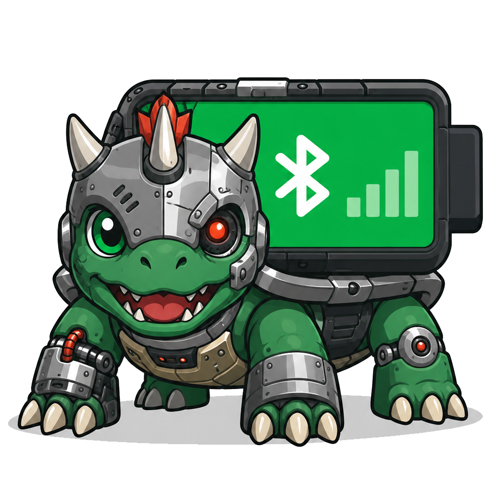

# 🔋 XBubamon


> Bluetooth Speaker Battery Monitor for Windows System Tray


---

## Features

- Real-time battery monitoring for Bluetooth speakers/headphones
- Dynamic system tray icon with dragon design
- Multi-device display with user selection
- Battery notifications at configurable thresholds
- Auto-refresh every 60 seconds
- Lightweight - no heavy GUI, just system tray icon

## Supported Devices

- Bluetooth Speaker
- Bluetooth Headphone / Headset
- Bluetooth Earbuds / Buds
- Any device with A2DP / AVRCP / Handsfree profile

## Requirements

- Windows 10/11
- Python 3.8+ (for running from source)
- Bluetooth adapter
- Paired Bluetooth speaker/headphone

## Quick Start

### Run from Releases

- Download from [Releases](https://github.com/vachzar/xbubamon/releases)
- Double-click XBubamon.exe
- XBubamon will shown in system tray bottom right of desktop. (sometimes in hiddens icons, drag-n-drop to show it)

### Run from Source

```bash
# Install dependencies
pip install pystray pillow

# Run
python bluetooth_battery_monitor.py
```

### Build to EXE

```bash
# Install PyInstaller
pip install pyinstaller

# Build
pyinstaller --onefile --windowed --icon=icon.ico --name "BT Battery" bluetooth_battery_monitor.py

# EXE is in dist/ folder
dist/BT Battery.exe
```

### Using build.bat

```bash
# Double-click build.bat
# EXE will be created in dist/ folder
```

## How It Works

### Connection Detection

Uses Windows property `{83DA6326-97A6-4088-9453-A1923F573B29} 15` to check if device is actually connected. Returns `True` when connected, `False` when disconnected.

### Battery Reading

Uses Windows property `{104EA319-6EE2-4701-BD47-8DDBF425BBE5} 2` to read battery level (0-100%).

### Detection Flow

```
1. Scan all Bluetooth devices with audio profile
2. Check connection status via property {83DA6326...}
3. If connected → read battery level
4. Display in system tray
```

## System Tray Icon

### Connected States

| Icon | Description |
|------|-------------|
| Green battery (>60%) | Battery full |
| Yellow battery (30-60%) | Battery medium |
| Red battery (<30%) | Battery low |

### Disconnected State

| Icon | Description |
|------|-------------|
| Gray with red X | Device disconnected |

## Menu Options

- **Refresh** - Rescan devices
- **Show Info** - Display device details and battery
- **Settings** - Select which devices to display
- **About** - Application info
- **Quit** - Exit application

## Settings

### Device Selection

Open Settings to see all connected Bluetooth devices. Check/uncheck devices to show in tray.

### Notifications

Battery notifications appear when level reaches:
- 50% (default)
- 40%
- 30%
- 20%
- 10%

Notifications only appear once per threshold until battery drops further.

## Configuration

Settings are saved in `settings.json`:

```json
{
  "visible_devices": ["Play 2 Avrcp Transport"],
  "notifications_enabled": true,
  "notification_thresholds": [50, 40, 30, 20, 10]
}
```

## Troubleshooting

### "No audio device" / Icon not showing

1. Make sure speaker/headphone is **paired** and **connected**
2. Check **Settings > Bluetooth & devices** - device must be active
3. Run as **Administrator** if needed

### Battery not showing (shows "?")

1. Device may not support battery reporting
2. Try disconnecting & reconnecting device
3. Restart Bluetooth service:
   ```powershell
   Restart-Service bthserv
   ```

### App slow on startup

- Normal to take ~5-7 seconds for initial scan
- This is due to PowerShell querying Windows API
- Subsequent refreshes are faster

### Notifications not appearing

1. Check Windows notification settings
2. Make sure notifications are enabled in app settings
3. Restart app after changing settings

## Tech Stack

- **Python 3.10+**
- **pystray** - System tray icon
- **Pillow (PIL)** - Icon image generation
- **PowerShell** - Windows API queries
- **WMI/PnP** - Device detection

## Project Structure

```
bluetooth_battery_monitor/
├── bluetooth_battery_monitor.py   # Main script
├── icon.png                       # App icon (PNG)
├── icon.ico                       # App icon (ICO)
├── logo.png                       # Logo
├── settings.json                  # User settings
├── README.md                      # This file
├── build.bat                      # Build script
├── .gitignore                     # Git ignore rules
└── docs/
    ├── plan.md                    # Feature plan
    ├── analysis.md                # Request analysis
    └── story.md                   # Development story
```

## Version History

### v0.1.0 (2026)

- Initial release
- Real-time battery monitoring
- Smart connection detection
- System tray integration
- Multi-device support
- Battery notifications
- Custom dragon icon

## Author

**JARxAI**

- Copyright (C) 2026

## License

MIT License

---

Made with Python and Bluetooth magic.

## Tips

### Run on Startup

1. Build to EXE first
2. Copy EXE to startup folder:
   ```
   %APPDATA%\Microsoft\Windows\Start Menu\Programs\Startup
   ```

### Create Shortcut

1. Right-click EXE → Create shortcut
2. Copy shortcut to Desktop or Start Menu

### Auto-start with Windows

```powershell
# Add to registry (run as admin)
reg add "HKCU\Software\Microsoft\Windows\CurrentVersion\Run" /v "BT Battery" /d "C:\Path\To\BT Battery.exe" /f
```

---

